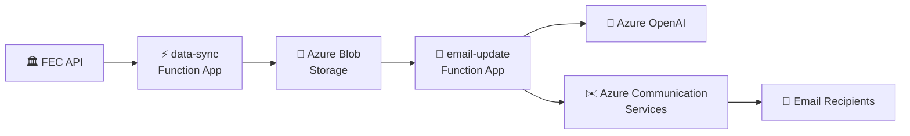

# 📊 FEC Data Sync & Email Update

A prototype application that syncs Federal Election Commission (FEC) filings data to Azure and sends email notifications with AI-generated summaries when new filings are detected.

## 🏗️ Architecture



See [Infrastructure Documentation][docs-infra] for the complete architecture diagram and resource details.

## 🚀 Quick Start

### Prerequisites

| Tool | Purpose | Installation |
|------|---------|--------------|
| Python 3.11+ | Runtime | [python.org][python] |
| uv | Package manager | [docs.astral.sh/uv][uv] |
| Azure Functions Core Tools | Local functions | [Install Guide][az-func-tools] |
| Azurite | Local storage emulator | `npm install -g azurite` |
| FEC API Key | Data access | [api.open.fec.gov][fec-api] |

### 1️⃣ Install Dependencies

```bash
make install
```

### 2️⃣ Configure Local Settings

```bash
# Copy example settings
cp apps/data-sync/local.settings.json.example apps/data-sync/local.settings.json
cp apps/email-update/local.settings.json.example apps/email-update/local.settings.json
```

Edit `apps/data-sync/local.settings.json` and add your FEC API key:

```json
{
  "Values": {
    "FEC_API_KEY": "your-fec-api-key-here",
    "FEC_COMMITTEE_IDS": "C00703975"
  }
}
```

### 3️⃣ Start Local Storage

```bash
make azurite-start
```

This starts [Azurite][azurite] on `http://127.0.0.1:10000` and creates the `fec-filings` container.

### 4️⃣ Run the Data Sync Function

```bash
make run-data-sync
```

Once running, trigger a sync:

```bash
curl -X POST http://localhost:7071/api/sync
```

This fetches FEC filings for your configured committees and stores them in local blob storage.

### 5️⃣ Preview & Test Emails

Stop data-sync (`Ctrl+C`) and start the email function:

```bash
make run-email-update
```

**Preview an email in your browser:**

```
http://localhost:7071/api/preview/{committee_id}
```

Example: `http://localhost:7071/api/preview/C00703975`

> 💡 **Tip:** The preview endpoint generates the full email HTML with AI summaries, analysis, and download links - perfect for testing without sending actual emails.

## 📡 API Endpoints

### Data Sync Function (port 7071)

| Endpoint | Method | Description |
|----------|--------|-------------|
| `/api/sync` | POST | Manually trigger FEC data sync |

### Email Update Function (port 7071)

| Endpoint | Method | Description |
|----------|--------|-------------|
| `/api/preview/{committee_id}` | GET | Preview email HTML in browser |
| `/api/send-test-email/{committee_id}` | POST | Send test email to configured recipients |
| `/api/download/{committee_id}/{period}/{filename}` | GET | Download processed CSV/XLSX files |

## ✅ Supported Forms & Reports

**Supported Form Types:**
| Form | Committee Type |
|------|----------------|
| F3 | House & Senate Candidate Committees |

**Supported Report Types:**
| Code | Description |
|------|-------------|
| Q1 | April Quarterly (Jan 1 - Mar 31) |
| Q2 | July Quarterly (Apr 1 - Jun 30) |
| Q3 | October Quarterly (Jul 1 - Sep 30) |
| YE | Year-End (Oct 1 - Dec 31) |

> 📌 **Note:** Only the above combinations generate formatted CSV/XLSX files and AI analysis. Other filings will sync but won't be fully processed.

See [FEC Form Types and Report Types Reference][docs-fec-types] for the complete list of all FEC codes.

## ⚙️ Configuration

See the [Configuration Guide][docs-config] for detailed instructions on:

- **Committee IDs** - How to configure which committees to monitor (locally and in Azure)
- **Report Type Filtering** - How to filter which filings to sync
- **FEC Form & Report Types** - Complete reference of all FEC codes with support status

### Quick Reference

```bash
# Single committee
FEC_COMMITTEE_IDS="C00703975"

# Multiple committees (comma-separated)
FEC_COMMITTEE_IDS="C00703975,C00618371,C00401224"
```

🔍 Find committee IDs on the [FEC website][fec-committees] by searching for a committee name.

> ⚠️ **Note:** Large committees with many transactions may produce reports that exceed email size limits or AI processing capacity. If you experience issues, try reducing the number of committees.

## 📁 Project Structure

```
├── apps/
│   ├── data-sync/           # ⚡ Syncs FEC data on a schedule
│   └── email-update/        # 📧 Sends email notifications on new filings
├── packages/
│   ├── fec-api-client/      # 🔌 Generated FEC API client
│   └── services/            # 🛠️ Shared services (email, storage, AI)
├── infra/                   # ☁️ Bicep templates for Azure
└── docs/                    # 📚 Documentation
```

## 🛠️ Make Commands

| Command | Description |
|---------|-------------|
| `make install` | 📦 Install dependencies |
| `make test` | 🧪 Run tests |
| `make lint` | 🔍 Run linting |
| `make azurite-start` | 💾 Start local storage |
| `make azurite-stop` | 🛑 Stop local storage |
| `make run-data-sync` | ⚡ Run data-sync locally |
| `make run-email-update` | 📧 Run email-update locally |
| `make deploy-all` | 🚀 Deploy to Azure |
| `make help` | ❓ Show all commands |

## ☁️ Deploy to Azure

See the [Deployment Guide][docs-deploy] for complete instructions on deploying to Azure, including:

- GitHub Actions CI/CD setup
- Manual deployment options
- Environment configuration
- Monitoring and troubleshooting

**Quick deploy:**

```bash
make az-login
make az-create-rg
export FEC_API_KEY=your-key
make deploy-all
```

## 📚 Documentation

| Document | Description |
|----------|-------------|
| [Prerequisites][docs-prereqs] | Azure subscription, services, and permissions required |
| [Configuration Guide][docs-config] | Committee IDs, report filtering, FEC form/report types |
| [Deployment Guide][docs-deploy] | Local dev setup, Azure deployment, CI/CD |
| [Infrastructure][docs-infra] | Azure resources and Bicep templates |

## 🔧 Azure Services Used

| Service | Purpose |
|---------|---------|
| [Azure Functions][az-functions] | ⚡ Serverless compute |
| [Azure Blob Storage][az-storage] | 💾 FEC filings storage |
| [Azure Communication Services][az-acs] | ✉️ Email delivery |
| [Azure OpenAI][az-openai] | 🤖 AI-generated summaries |
| [Application Insights][az-app-insights] | 📊 Monitoring |

## 📄 License

See [LICENSE][license] for details.

<!-- Reference Links -->
[python]: https://www.python.org/downloads/
[uv]: https://docs.astral.sh/uv/
[az-func-tools]: https://learn.microsoft.com/azure/azure-functions/functions-run-local
[azurite]: https://learn.microsoft.com/azure/storage/common/storage-use-azurite
[fec-api]: https://api.open.fec.gov/developers/
[az-functions]: https://learn.microsoft.com/azure/azure-functions/functions-overview
[az-storage]: https://learn.microsoft.com/azure/storage/blobs/storage-blobs-introduction
[az-acs]: https://learn.microsoft.com/azure/communication-services/overview
[az-openai]: https://learn.microsoft.com/azure/ai-services/openai/overview
[az-app-insights]: https://learn.microsoft.com/azure/azure-monitor/app/app-insights-overview
[docs-prereqs]: ./docs/prerequisites.md
[docs-config]: ./docs/configuration.md
[docs-deploy]: ./docs/deployment.md
[docs-infra]: ./docs/infrastructure.md
[docs-fec-types]: ./docs/configuration.md#fec-form-types-reference
[license]: ./LICENSE
[fec-committees]: https://www.fec.gov/data/committees/
