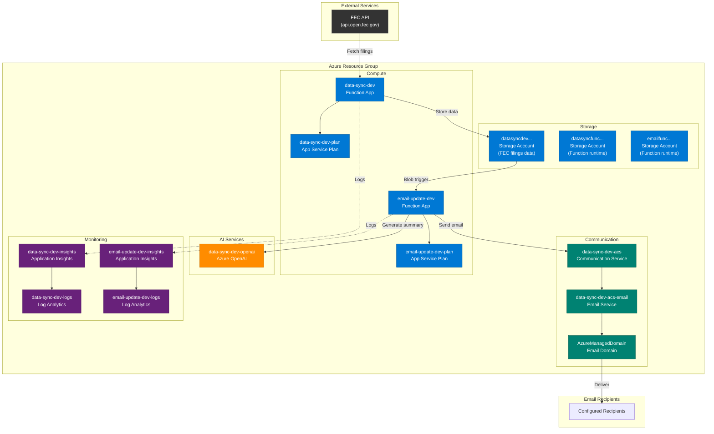

# Azure Infrastructure

This document describes the Azure resources deployed by the Bicep templates.

## Architecture Diagram



## Resources Overview

| Resource                    | Type                                     | Purpose                                       |
| --------------------------- | ---------------------------------------- | --------------------------------------------- |
| `data-sync-dev`             | [Function App][az-functions]             | Syncs FEC filings data on a schedule          |
| `email-update-dev`          | [Function App][az-functions]             | Sends email notifications when new filings detected |
| `data-sync-dev-plan`        | [App Service Plan][az-app-service]       | Hosts the data-sync function                  |
| `email-update-dev-plan`     | [App Service Plan][az-app-service]       | Hosts the email-update function               |
| `datasyncdev...`            | [Storage Account][az-storage]            | Stores FEC filings data and manifests         |
| `datasyncfunc...`           | [Storage Account][az-storage]            | Azure Functions runtime storage               |
| `emailfunc...`              | [Storage Account][az-storage]            | Email function runtime storage                |
| `data-sync-dev-openai`      | [Azure OpenAI][az-openai]                | Generates AI summaries of filings             |
| `data-sync-dev-acs`         | [Communication Services][az-acs]         | Email sending capability                      |
| `data-sync-dev-acs-email`   | [Email Service][az-acs-email]            | Email service configuration                   |
| `AzureManagedDomain`        | [Email Domain][az-acs-email]             | Azure-managed sender domain                   |
| `data-sync-dev-insights`    | [Application Insights][az-app-insights]  | Monitoring for data-sync                      |
| `email-update-dev-insights` | [Application Insights][az-app-insights]  | Monitoring for email-update                   |
| `data-sync-dev-logs`        | [Log Analytics][az-log-analytics]        | Centralized logging for data-sync             |
| `email-update-dev-logs`     | [Log Analytics][az-log-analytics]        | Centralized logging for email-update          |

## Bicep Templates

| File                                            | Description                               |
| ----------------------------------------------- | ----------------------------------------- |
| [`main.bicep`][bicep-main]                      | Main orchestration template               |
| [`storage.bicep`][bicep-storage]                | Storage Account and Blob Containers       |
| [`data-sync-app.bicep`][bicep-data-sync]        | Data sync Function App with monitoring    |
| [`email-update-app.bicep`][bicep-email-update]  | Email update Function App with monitoring |
| [`communication-services.bicep`][bicep-acs]     | Azure Communication Services for email    |
| [`openai.bicep`][bicep-openai]                  | Azure OpenAI for AI summaries             |
| [`role-assignment.bicep`][bicep-role]           | RBAC role assignments                     |

## Deployment

### Quick Start

```bash
# 1. Login to Azure
make az-login

# 2. Create resource group
make az-create-rg

# 3. Register required providers (first time only)
make az-register-providers

# 4. Deploy everything
export FEC_API_KEY=your-fec-api-key
make deploy-all
```

### Step-by-Step Deployment

```bash
# Deploy infrastructure only
make deploy-infra

# Deploy function apps separately
make deploy-data-sync
make deploy-email-update
```

### Custom Configuration

Override defaults with environment variables:

```bash
export AZURE_RESOURCE_GROUP=my-rg
export AZURE_LOCATION=westus2
export ENVIRONMENT=prod
export FEC_API_KEY=your-key

make deploy-all
```

## Parameters

### Main Parameters

| Parameter                   | Type         | Default                  | Description                                     |
| --------------------------- | ------------ | ------------------------ | ----------------------------------------------- |
| `location`                  | string       | Resource group location  | [Azure region][az-regions]                      |
| `environment`               | string       | `dev`                    | Environment: `dev`, `staging`, `prod`           |
| `baseName`                  | string       | `data-sync`              | Base name for resources                         |
| `fecApiKey`                 | securestring | -                        | [FEC API key][fec-api] (required)               |
| `appServicePlanSku`         | string       | `Y1`                     | [SKU][az-app-service-sku]: Y1, EP1, EP2, EP3    |
| `enableApplicationInsights` | bool         | `true`                   | Enable monitoring                               |
| `logRetentionDays`          | int          | `90`                     | Log retention (30-730 days)                     |
| `openAIModel`               | string       | `gpt-4o-mini`            | [OpenAI model][az-openai-models] to deploy      |

### Optional Email Configuration

| Parameter               | Type         | Description                            |
| ----------------------- | ------------ | -------------------------------------- |
| `emailConnectionString` | securestring | ACS connection string (auto-generated) |
| `emailSenderAddress`    | string       | Sender email address (auto-generated)  |
| `emailRecipientList`    | string       | Comma-separated recipient emails       |

### Optional Filtering

| Parameter         | Type   | Description                                       |
| ----------------- | ------ | ------------------------------------------------- |
| `fecCandidateIds` | string | Comma-separated FEC candidate IDs                 |
| `fecReportTypes`  | string | Comma-separated report types (e.g., `F3,F3P,F3X`) |

## Outputs

| Output                    | Description                    |
| ------------------------- | ------------------------------ |
| `storageAccountName`      | Data storage account name      |
| `blobAccountUrl`          | Blob storage URL               |
| `functionAppName`         | Data-sync function app name    |
| `functionAppHostname`     | Data-sync function URL         |
| `emailFunctionAppName`    | Email-update function app name |
| `emailFunctionAppHostname`| Email-update function URL      |
| `emailSenderAddress`      | Auto-generated sender address  |
| `azureOpenAIEndpoint`     | Azure OpenAI endpoint          |

## Security

- All storage accounts enforce [TLS 1.2+][az-tls]
- HTTPS-only traffic
- Blob public access disabled
- [Managed identity][az-managed-identity] for service-to-service authentication
- Sensitive values stored as app settings (consider [Key Vault][az-keyvault] for production)
- FTPS disabled on Function Apps

## Cost Optimization

- Default [Consumption plan (Y1)][az-consumption] for pay-per-execution billing
- Log retention set to 90 days (adjustable)
- Consider [reserved capacity][az-reserved] for production workloads

<!-- Reference Links - Official Documentation -->
[az-functions]: https://learn.microsoft.com/azure/azure-functions/functions-overview
[az-app-service]: https://learn.microsoft.com/azure/app-service/overview-hosting-plans
[az-app-service-sku]: https://learn.microsoft.com/azure/app-service/overview-hosting-plans#how-much-does-my-app-service-plan-cost
[az-storage]: https://learn.microsoft.com/azure/storage/blobs/storage-blobs-introduction
[az-openai]: https://learn.microsoft.com/azure/ai-services/openai/overview
[az-openai-models]: https://learn.microsoft.com/azure/ai-services/openai/concepts/models
[az-acs]: https://learn.microsoft.com/azure/communication-services/overview
[az-acs-email]: https://learn.microsoft.com/azure/communication-services/concepts/email/email-overview
[az-app-insights]: https://learn.microsoft.com/azure/azure-monitor/app/app-insights-overview
[az-log-analytics]: https://learn.microsoft.com/azure/azure-monitor/logs/log-analytics-overview
[az-regions]: https://azure.microsoft.com/explore/global-infrastructure/geographies
[az-tls]: https://learn.microsoft.com/azure/storage/common/transport-layer-security-configure-minimum-version
[az-managed-identity]: https://learn.microsoft.com/azure/active-directory/managed-identities-azure-resources/overview
[az-keyvault]: https://learn.microsoft.com/azure/key-vault/general/overview
[az-consumption]: https://learn.microsoft.com/azure/azure-functions/consumption-plan
[az-reserved]: https://learn.microsoft.com/azure/cost-management-billing/reservations/save-compute-costs-reservations
[fec-api]: https://api.open.fec.gov/developers/

<!-- Internal Links -->
[bicep-main]: ../infra/main.bicep
[bicep-storage]: ../infra/storage.bicep
[bicep-data-sync]: ../infra/data-sync-app.bicep
[bicep-email-update]: ../infra/email-update-app.bicep
[bicep-acs]: ../infra/communication-services.bicep
[bicep-openai]: ../infra/openai.bicep
[bicep-role]: ../infra/role-assignment.bicep
